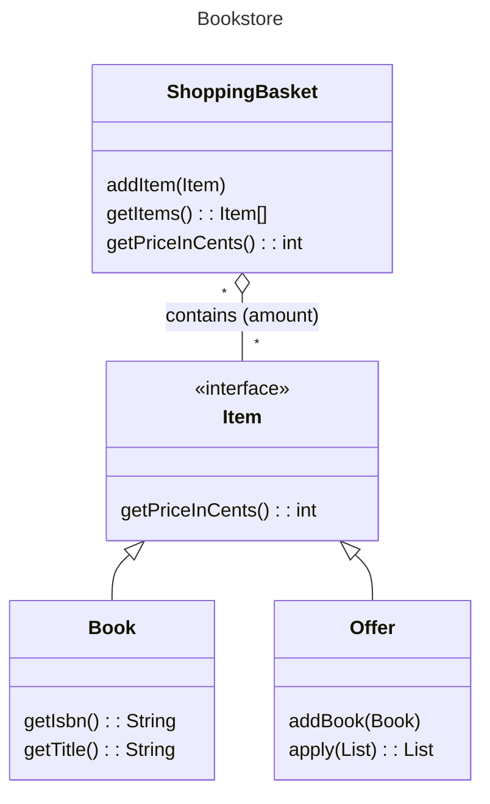

# Case Study: Bookstore

This repository contains the code for solving the exercise in domain driven design and 
object oriented programming which can be found in [`problem.md`](./problem.md).

## Requirements

- Java JDK of at least Version 11
- Apache Maven

To run the tests, execute `mvn test` in the project root.

To try out the command line shop, you can compile it and run it:
```sh
mvn package
cd target
java -jar java -jar potter-kata-1.0-SNAPSHOT.jar
```

## Data Model

This data model assumes that the store may sell other books than those included in the
Wizard Series. If there are other offers, it could be sensible to introduce some kind of 
`Offer`-Interface. Other non-book items could be introduced as well.



## Remarks

Brute-forcing the solution is feasible only for small inputs, otherwise the required computation
grows exponentially.

Trying out different inputs yielded the insight that with at most 5 different books, there is really 
only one special case: That two sets of 4 are better than one set of 5 and one set of 3. This allows
for the simple heuristic to fill the sets as tightly as possible, and then combine sets of 5 and 3 
wherever possible.

Using Java 17 would have been nice here, because then `Book` could be a record, sparing me the 
`hashCode` and `equals`-customizations necessary to use it as hashmap key.
