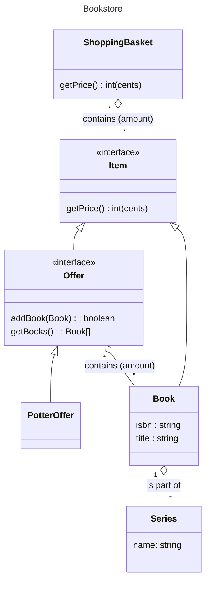

# Case Study: Bookstore

This repository contains the code for solving the exercise in domain driven design and 
object oriented programming which can be found in [`problem.md`](./problem.md).

## Requirements

- Java JDK of at least Version 11
- Apache Maven

To run the tests, execute `mvn test` in the project root.

## Data Model

This data model assumes that the store may sell other books than those included in the
Wizard Series, and that there may be other Offers in the future. 

